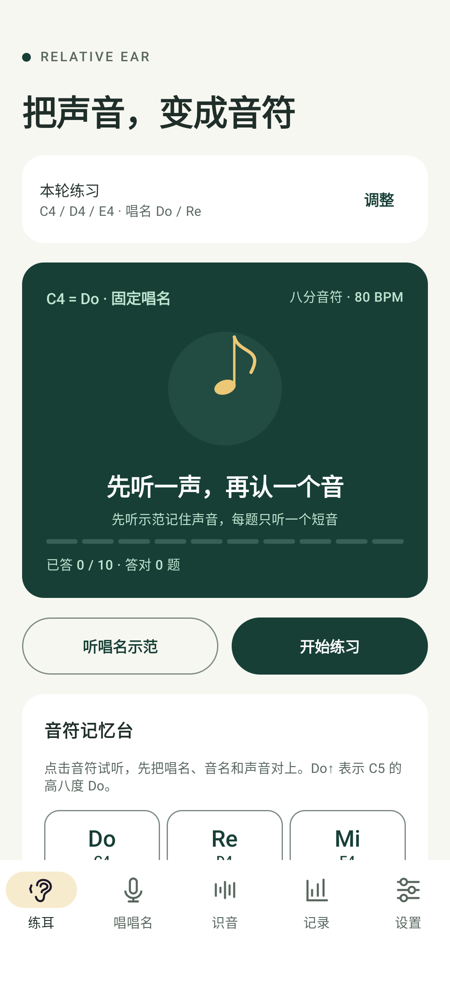
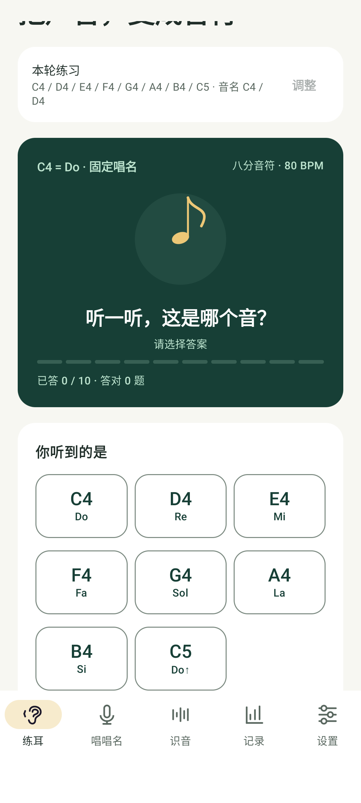

# Relative Ear

**听出 Do / Re / Mi，唱准旋律。** 一个面向音乐爱好者的 Android 练习工具：听唱名、唱唱名，以及实时识别人声或乐器的单音旋律。不需要先学“大三度、小二度”等音程术语。

Android **8.0 及以上**，中文界面，无账号，训练与识音可离线使用。声音只在手机本地处理，不保存录音、不上传音频；手动检查更新时需要联网。

> 当前为 `0.0.5` 早期版本。已实现下述基础功能，但尚未完成真机音准、延迟和机型兼容验证。正式安装包由 GitHub Actions 构建并发布到 Releases，以页面实际可下载资产为准。

## 安装

发布后，从 [GitHub Releases](https://github.com/gongpx20069/relative-ear/releases) 下载适合手机架构的 APK，不要下载源码压缩包。所有安装包都使用 `0.0.x` 版本号。

| 安装包 | 适用设备 |
|---|---|
| `relative-ear-0.0.x-arm64-v8a.apk` | 大多数现代 Android 手机，64 位 ARM 系统 |
| `relative-ear-0.0.x-armeabi-v7a.apk` | 较老的手机或 32 位 ARM 系统 |
| `relative-ear-0.0.x-x86_64.apk` | 64 位 Intel 设备或对应 Android 模拟器 |
| `relative-ear-0.0.x-x86.apk` | 32 位 Intel 设备或对应 Android 模拟器 |
| `relative-ear-0.0.x-universal.apk` | 不确定架构时选这个；包含全部架构，体积稍大 |

每个 APK 都是完整安装包，只需下载其中一个，不需要把多个架构包一起安装。以手机系统支持的架构为准，不能只看 CPU 是否为 64 位。Release 的 `SHA256SUMS.txt` 提供五个 APK 的文件校验值。

当前 `0.0.5`：[64 位 ARM 安装包](https://github.com/gongpx20069/relative-ear/releases/download/v0.0.5/relative-ear-0.0.5-arm64-v8a.apk) · [通用安装包](https://github.com/gongpx20069/relative-ear/releases/download/v0.0.5/relative-ear-0.0.5-universal.apk) · [全部架构与校验文件](https://github.com/gongpx20069/relative-ear/releases/tag/v0.0.5)。

1. 将 APK 下载到手机，点击安装。
2. 如果系统提示不允许安装，给你正在使用的浏览器或文件管理器开启“允许安装未知应用”。
3. 打开 Relative Ear，默认进入 **练耳**；只有使用 **唱唱名** 或 **识音** 时才需要麦克风权限。

新版本直接覆盖安装，训练记录会保留。正式发布包需使用同一签名；本地 debug 包与正式包不能保证互相覆盖，卸载会删除记录。

本地开发构建的通用安装包位于 `app\build\outputs\apk\debug\app-universal-debug.apk`，同目录还有各架构的开发包。开发构建与签名方法见 [开发指南](docs/DEVELOPMENT.md) 和 [发布指南](docs/RELEASE.md)。

## 先练听唱名：听到声音，认出 Do / Re / Mi

1. 进入 **练耳**，默认练 `C4 / D4 / E4`，对应 **Do / Re / Mi**。
2. 先在 **音符记忆台** 点击音符试听，或点击 **听唱名示范**。示范时会同步显示正在播放的音名、唱名和八分音符谱位。
3. 点击 **开始练习**，每题只播放一个短音，选择你听到的音符。答题前的图案只是八分音符图标，不透露实际谱位。
4. 答题后查看正确音符，可以 **听正确答案**，再点 **下一题**。每轮 10 题，答题不限时，可以重播。
5. 点 **本轮练习 → 调整**，选择三音、五音、八音或自由点选考核音符，答案可以切换为 **唱名 Do / Re** 或 **音名 C4 / D4**。范围、显示方式和速度自动保存在手机上；本轮开始后配置锁定，避免中途改题。

当前采用**固定唱名**：`C4=Do、D4=Re、E4=Mi、F4=Fa、G4=Sol、A4=La、B4=Si、C5=Do↑`，不会随机换调。Do↑ 表示高八度的 Do，选项同时显示八度，C4 和 C5 不会混为一个答案。默认 A4=440 Hz，C4 约 261.63 Hz；若手动改变调音基准，全部声音会随之调整。

建议先用三音、80 BPM 练熟声音，再扩展五音和八音。**八分音符是节奏时值，不是“八个音”的意思**：按四分音符为一拍，每个短音占半拍。支持 60/80/100/120 BPM；80 BPM 每音 375 毫秒，包含尾部短促断奏间隔。速度仅影响播放，不考核点击节奏或回唱节奏。

成绩只计首次提交的答案。当前为练习模式，尚无单独的考试模式。

## 再练唱唱名：知道 Mi 是什么感觉，也能把它唱出来

1. 进入 **唱唱名**，选择要练的音符范围，先听示范。
2. 点击 **开始回唱**，先听固定 C4，再按谱面与提示唱出目标，例如 **Mi / E4**。
3. 出现“请唱目标音”后再唱，尽量稳定保持至少半秒。
4. App 会显示实际唱出的音名、音准指示与相对目标的偏差；正数表示偏高，负数表示偏低。
5. 答题后可以听正确答案，再进入下一题，每轮 10 题。

默认音准容差为 ±35 音分（100 音分等于一个半音），可以在设置里改为 ±20 或 ±50。未保存过八度选项的用户默认**区分八度**；如果 C4–C5 不适合自己的音域，可以在设置里开启 **回唱忽略八度**，唱高或低八度的同一个唱名。已有手动设置保留，这个选项只影响回唱评分，不合并听辨的 C4/C5 答案。

使用有线耳机效果更好。没有耳机时，等待播放结束再唱，避免手机把自己的声音当成你的回答。8 秒内没有形成稳定单音时会显示超时，超时计入回唱成绩。

## 识音：观察周围的单音旋律

1. 进入 **识音**，点击 **开始监听**。
2. 哼唱，或让手机靠近只演奏一个音的乐器。
3. 查看当前音名（如 `A4`）、频率、音分偏差和近 10 秒的音高曲线。
4. 一个音结束或换音后，会加入下方音符列表，附带起始时间和持续时间。
5. 点击 **停止**，最后一个持续音也会加入列表。

连续唱相同的音时，请留短暂停顿，否则可能被视为同一个长音。列表仅保留本次监听最近 30 个音，不保存成录音或乐谱。

**这里的“识音”不是查歌名，也不是完整歌曲转谱。** 适合人声、笛子、吉他单音、钢琴单音旋律。多人同时唱、钢琴和弦和带伴奏歌曲可能产生错误结果；鼓声、噪声等也可能没有明确音高。

## 记录与设置

- **记录**：查看累计题数、正确题数、最近 100 题及回唱偏差。结果自动保存到本机，关闭 App 后仍保留。
- 升级保留旧成绩；旧版音程、首调与回唱记录会单独标明，不把旧题目重新解释为固定唱名。新记录附带当时的考核范围、答案形式和播放速度。
- **设置**：调整 A4 调音基准（415–466 Hz）、音准容差和是否忽略八度。
- **删除全部训练记录**：确认后删除本地成绩，不可恢复；不会重置设置。
- 切换页面、锁屏或切到后台会停止录音。未完成题目不计成绩，返回后需手动开始。

## 检查更新

进入 **设置 → 版本与更新 → 检查更新**。有新的公开版本（包含 `0.0.x` 预览版）时，App 会显示版本号并提示 **前往下载**，优先选择手机支持的架构；无法匹配时选择通用包。选择“稍后再说”后，仍可在更新卡片点“下载 APK”或查看发布说明。

下载链接会交给浏览器或系统可处理链接的应用打开。下载后手动安装，可覆盖正式旧版并保留记录；App 不自动下载或安装，也不后台检查。联网失败、GitHub 限流或发布资产不完整会明确提示，可以重试或直接打开发布页面。离线训练不受影响。

`0.0.4` 及更早版本还没有此入口，需要先从 Releases 手动安装 `0.0.5` 或更新版本。

## 常见问题

**为什么一直没有识别结果？**
先确认麦克风权限，停止其他录音应用，靠近手机，用稳定单音测试。音量太小、声音过短或环境复杂时，不一定能识别。检测范围约 65–1000 Hz。

**为什么显示高或低一个八度？**
泛音、手机麦克风及复杂声源可能影响检测。试试换距离、降低背景噪声；回唱可按需要开启忽略八度，但它不会让复杂音乐转录变准确。

**拒绝权限以后怎么办？**
练耳不受影响。唱唱名或识音可再次请求权限；永久拒绝后需去系统“应用 → Relative Ear → 权限”开启麦克风。

**数据会传出去吗？**
App 不使用分析 SDK、不保存原始音频，训练结果和设置仅保存在本机，系统云备份关闭。仅点击检查更新时向 GitHub 查询公开发布信息，不发送录音或成绩；打开下载链接后由外部应用处理下载。详见 [隐私说明](docs/PRIVACY.md)。

## 文档

完整文档导航见 [agent.md](agent.md)。产品边界与评分依据见 [设计文档](docs/DESIGN.md)，已实现范围与构建方法见 [开发指南](docs/DEVELOPMENT.md)。
